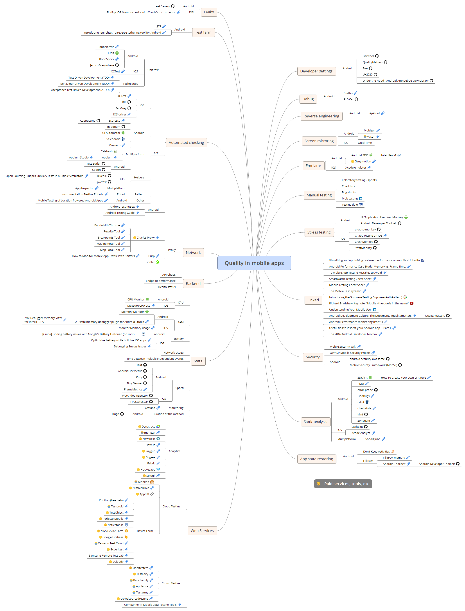

# Quality in mobile apps mindmap

Table of Contents
=================

   * [Quality in mobile apps mindmap](#quality-in-mobile-apps-mindmap)
   * [Table of Contents](#table-of-contents)
      * [Legend](#legend)
      * [Accessibility](#accessibility)
         * [Android](#android)
            * [Tools](#tools)
         * [iOS](#ios)
      * [Developer settings](#developer-settings)
         * [Android](#android-1)
         * [iOS](#ios-1)
      * [Debug](#debug)
         * [Android](#android-2)
      * [Reverse engineering](#reverse-engineering)
         * [Android](#android-3)
      * [Screen mirroring](#screen-mirroring)
         * [Android](#android-4)
         * [iOS](#ios-2)
      * [Emulator/simulator](#emulatorsimulator)
         * [Android](#android-5)
         * [iOS](#ios-3)
      * [Manual testing](#manual-testing)
      * [Visual testing](#visual-testing)
         * [Android](#android-6)
         * [iOS](#ios-4)
      * [Stress testing](#stress-testing)
         * [Android](#android-7)
         * [iOS](#ios-5)
      * [Linked](#linked)
         * [Android](#android-8)
         * [iOS](#ios-6)
         * [React Native](#react-native)
         * [All](#all)
      * [Books](#books)
      * [Security](#security)
         * [Android](#android-9)
         * [iOS](#ios-7)
         * [Multiplatform](#multiplatform)
      * [Static analysis](#static-analysis)
         * [Android](#android-10)
         * [iOS](#ios-8)
         * [Multiplatform](#multiplatform-1)
      * [App state restoring](#app-state-restoring)
         * [Android](#android-11)
            * [Fill RAM](#fill-ram)
      * [Web Services](#web-services)
         * [Analytics](#analytics)
         * [Cloud Testing](#cloud-testing)
         * [Device Farm](#device-farm)
         * [Crowd Testing](#crowd-testing)
      * [Stats](#stats)
         * [CPU](#cpu)
            * [Android](#android-12)
            * [iOS](#ios-9)
         * [RAM](#ram)
            * [Android](#android-13)
            * [iOS](#ios-10)
         * [Battery](#battery)
            * [Android](#android-14)
            * [iOS](#ios-11)
         * [Speed](#speed)
            * [Android](#android-15)
            * [iOS](#ios-12)
         * [Monitoring](#monitoring)
         * [Duration of the method](#duration-of-the-method)
            * [Android](#android-16)
            * [iOS](#ios-13)
         * [Binary size](#binary-size)
            * [Android](#android-17)
         * [Other](#other)
            * [Network Usage](#network-usage)
            * [Time between multiple independent events](#time-between-multiple-independent-events)
      * [Backend](#backend)
         * [API Chaos](#api-chaos)
         * [Endpoint performance](#endpoint-performance)
         * [Health status](#health-status)
      * [Network](#network)
         * [Proxy](#proxy)
         * [Tools](#tools-1)
      * [Automated checking](#automated-checking)
         * [Unit test](#unit-test)
            * [Android](#android-18)
            * [iOS](#ios-14)
               * [Network Stubbing](#network-stubbing)
         * [Coverage](#coverage)
            * [Android](#android-19)
            * [iOS](#ios-15)
         * [Techniques](#techniques)
         * [e2e](#e2e)
            * [Android](#android-20)
            * [iOS](#ios-16)
         * [Multiplatform](#multiplatform-2)
         * [Helpers](#helpers)
            * [Android](#android-21)
            * [iOS](#ios-17)
               * [Network Stubbing](#network-stubbing-1)
               * [Multiplatfom](#multiplatfom)
         * [Pattern](#pattern)
            * [Robot](#robot)
         * [Other](#other-1)
            * [Android](#android-22)
      * [Android](#android-23)
      * [Test farm](#test-farm)
         * [Android](#android-24)
         * [Other](#other-2)
      * [Leaks](#leaks)
         * [Android](#android-25)
         * [iOS](#ios-18)
      * [Other](#other-3)
         * [Android](#android-26)
      * [Mindmap](#mindmap)
   * [Contributing](#contributing)
   * [License](#license)

## Legend
:moneybag: - Paid services, tools, etc

## Accessibility

### Android
* [Accessibility - docs](https://developer.android.com/guide/topics/ui/accessibility/index.html)
* [Accessibility Developer Checklist](https://developer.android.com/guide/topics/ui/accessibility/checklist.html)
* [Android Accessibility Tutorial: Getting Started](https://www.raywenderlich.com/182100/android-accessibility-tutorial-getting-started)

#### Tools
* [Accessibility Scanner](https://play.google.com/store/apps/details?id=com.google.android.apps.accessibility.auditor)

### iOS
* [Accessibility - docs](https://developer.apple.com/accessibility/ios/)
* [iOS Accessibility Tutorial: Getting Started](https://www.raywenderlich.com/142058/ios-accessibility-tutorial)

## Developer settings

### Android
* [Barstool](https://github.com/wmbest2/Barstool)
* [QualityMatters](https://github.com/artem-zinnatullin/qualitymatters)
* [Bee](https://github.com/orhanobut/bee)
* [U+2020](https://github.com/JakeWharton/u2020)
* [Under the Hood - Android App Debug View Library](https://github.com/patrickfav/under-the-hood)
* [Debug artist](https://github.com/BaristaVentures/debug-artist)
* [Cockpit](https://github.com/Polidea/Cockpit)
* [Hyperion](https://github.com/willowtreeapps/Hyperion-Android)

### iOS
* [Yoshi](https://github.com/prolificinteractive/Yoshi)
* [FLEX](https://github.com/Flipboard/FLEX)
* [Tweaks](https://github.com/facebook/Tweaks)
* [CocoaDebug](https://github.com/CocoaDebug/CocoaDebug)

## Debug

### Android
* [Stetho](http://facebook.github.io/stetho/)
* [PID Cat](https://github.com/JakeWharton/pidcat)
* [HyperLog Android](https://github.com/hypertrack/hyperlog-android)

## Reverse engineering

### Android
* [Apktool](https://ibotpeaches.github.io/Apktool/)
* [JADX](https://github.com/skylot/jadx)
* [smali](https://github.com/JesusFreke/smali)

## Screen mirroring

### Android
* [Mobizen](https://www.mobizen.com/)
* [Vysor](https://www.vysor.io/) :moneybag:
* [scrcpy](https://github.com/Genymobile/scrcpy)

### iOS
* QuickTime

## Emulator/simulator

### Android
* [Android SDK](https://developer.android.com/studio/run/managing-avds.html)
    * [Intel HAXM](https://software.intel.com/en-us/android/articles/intel-hardware-accelerated-execution-manager)
* [Genymotion](https://www.genymotion.com/) :moneybag:

### iOS
* [Xcode simulator](https://developer.apple.com/library/content/documentation/IDEs/Conceptual/iOS_Simulator_Guide/Introduction/Introduction.html)
* [simctl: Control iOS Simulators from Command Line](http://shashikantjagtap.net/simctl-control-ios-simulators-command-line/?utm_content=buffer5c6da)
* [Sherlock](https://sherlock.inspiredcode.io/) :moneybag:

## Manual testing
* Eploratory testing - sprints
* Checklists
* Bug Hunts
* [Mob testing](http://www.slideshare.net/maaretp/mob-testing)
* [Testing dojo](http://www.methodsandtools.com/archive/archive.php?id=114)

## Visual testing

### Android
* [screenshot-tests-for-android](http://facebook.github.io/screenshot-tests-for-android/)
    * [Shot](https://github.com/Karumi/Shot)
* [Designer Tools](https://play.google.com/store/apps/details?id=com.scheffsblend.designertools)
* [nakal](https://github.com/saikrishna321/nakal_java)
* [Hyperion - App Inspection Tool](https://github.com/willowtreeapps/Hyperion-Android)

### iOS
* [FBSnapshotTestCase](https://github.com/facebook/ios-snapshot-test-case)
* [Flawless App](https://flawlessapp.io/) :moneybag:
* [Hyperion - In App Design Review Tool](https://github.com/willowtreeapps/Hyperion-iOS)

## Stress testing

### Android
* [UI/Application Exerciser Monkey](https://developer.android.com/studio/test/monkey.html)
* [Android Developer Toolbelt](https://github.com/T-Spoon/Android-Developer-Toolbelt)

### iOS
* [ui-auto-monkey](https://github.com/jonathanpenn/ui-auto-monkey) - DEPRECATED
* [CrashMonkey](https://github.com/mokemokechicken/CrashMonkey)
* [SwiftMonkey](https://github.com/zalando/SwiftMonkey)

## Linked

### Android
* [Android Performance Case Study: Memory vs. Frame Time](http://blog.karumi.com/android-performance-case-study-memory-vs-frame-time/)
* [Android Development Culture. The Document. #qualitymatters](https://artemzin.com/blog/android-development-culture-the-document-qualitymatters/)
    * [QualityMatters](https://github.com/artem-zinnatullin/qualitymatters)
* [Android Performance monitoring [Part 1]](https://blog.mindorks.com/android-performance-monitoring-part-1-1ce1b8df8a12#.xvmd7s505)
* [Useful tips to inspect your Android app — Part 1](https://medium.com/freenet-engineering/useful-tips-to-inspect-your-android-app-part-1-34415239e91a#.t59kbicht)
* [The 2016 Android Developer Toolbox](https://realm.io/news/mobilization-gautier-mechling-the-2016-android-developer-toolbox/)
* [Mobile Testing of Location-Powered Android Apps](http://blog.perfectomobile.com/mobile-application-testing/continuous-mobile-testing-of-location-powered-apps-with-perfecto/)
* [Ultimate Android Reference](https://github.com/aritraroy/UltimateAndroidReference)
* [Android UI Automation: Part 1, Building Trust](https://slack.engineering/android-ui-automation-part-1-building-trust-de3deb1c5995)
* [Android UI Automation: Part 2, Making It Easy](https://slack.engineering/android-ui-automation-part-2-making-it-easy-57335c7379cc)
* [Kotlin: Using (Test) Robots to make Espresso](https://proandroiddev.com/kotlin-using-test-robots-to-make-espresso-8cec2d746973)
* [Testing in-app purchases on Android](https://medium.com/bleeding-edge/testing-in-app-purchases-on-android-a6de74f78878)
* [Using Gradle build cache with Kotlin](https://blog.jetbrains.com/kotlin/2018/02/using-gradle-build-cache-with-kotlin/)
* [Add Superpowers to your Appium-Android tests](https://badootech.badoo.com/add-superpowers-to-your-appium-android-tests-f408ac2f1b59)
* [Performance Testing of Android Apps](https://appiumpro.com/editions/5)
* [Running arbitrary ADB commands via Appium](https://appiumpro.com/editions/3)
* [Kotlin Static Analysis — why and how?](https://proandroiddev.com/kotlin-static-analysis-why-and-how-a12042e34a98)
* [Android Testing Codelab](https://codelabs.developers.google.com/codelabs/android-testing/index.html)
* [Android CI with kubernetes](https://medium.com/@Malinskiy/android-ci-with-kubernetes-684713a83eec)
* [Taming the UI test monster](https://medium.com/stepstone-tech/taming-the-ui-test-monster-26c017848ae0)
* [Android testing with Espresso’s Idling Resources and testing fidelity](https://medium.com/androiddevelopers/android-testing-with-espressos-idling-resources-and-testing-fidelity-8b8647ed57f4)

### iOS
* [Optimizing Swift build times](https://github.com/fastred/Optimizing-Swift-Build-Times)
* [Testing iOS App Upgrades](https://appiumpro.com/editions/6)
* [5 Tools for Uploading iOS apps to iTunes Connect](http://shashikantjagtap.net/5-tools-uploading-ios-apps-itunes-connect/)
* [Using unit tests to identify & avoid memory leaks in Swift](https://medium.com/@johnsundell/using-unit-tests-to-identify-avoid-memory-leaks-in-swift-607c97465b62)
* [Xcode UI Tests with Embassy and Succulent](https://medium.com/@timefrancesco/xcode-ui-tests-with-embassy-and-succulent-808e068ee4e8)
* [UI Testing Cheat Sheet and Examples](http://masilotti.com/ui-testing-cheat-sheet/)
* [Getting started with XCUITest framework for testing iOS apps.](https://blog.novoda.com/getting-started-with-xcuitest-framework-for-testing-ios-apps/)
* [New XCUITest Features With Xcode 9: Hands-on Exploration](https://dzone.com/articles/new-xcuitest-features-with-xcode-9-hands-on-explor)
* [User Interface Testing - Apple Docs](https://developer.apple.com/library/content/documentation/DeveloperTools/Conceptual/testing_with_xcode/chapters/09-ui_testing.html)

### React Native
* [How to Apply UI Test Automation in React Native Apps?](https://www.polidea.com/blog/how-to-apply-ui-test-automation-in-react-native-apps/)

### All
* [Visualizing and optimizing real user performance on mobile - LinkedIn](https://www.facebook.com/atscaleevents/videos/vl.531312673697503/1693979707541793/?type=1)
* [10 Mobile App Testing Mistakes to Avoid](http://adventuresinqa.com/2016/05/03/10-mobile-app-testing-mistakes-to-avoid/)
* [Smartwatch Testing Cheat Sheet](http://adventuresinqa.com/2016/05/30/smartwatch-testing-cheat-sheet/)
* [Mobile Testing Cheat Sheet](http://adventuresinqa.com/2016/01/11/mobile-testing-cheat-sheet/)
* [The Mobile Test Pyramid](http://www.ministryoftesting.com/2014/10/mobile-test-pyramid/)
* [Introducing the Software Testing Cupcake (Anti-Pattern)](https://www.thoughtworks.com/insights/blog/introducing-software-testing-cupcake-anti-pattern)
* [Richard Bradshaw, keynote: "Mobile - the clue is in the name"](https://www.youtube.com/watch?v=CWMZXmkGPEI)
* [Understanding Your Mobile User](http://www.slideshare.net/sjanaway/understanding-your-mobile-user)
* [The complete Checklist for Mobile Testing | David Tzemach](http://www.machtested.com/2016/07/mobile-testing-checklist-david-tzemach.html)
* [Applying the SFDPOT heuristic to mobile testing](http://karennicolejohnson.com/2012/05/applying-the-sfdpot-heuristic-to-mobile-testing/)
* [Mobile App Test Coverage Model : LONG FUN CUP](https://testingideas.wordpress.com/2014/08/17/mobile-app-test-coverage-model-long-fun-cup/)
* [Ooga-chaka: Git hooks to enforce code quality](https://proandroiddev.com/ooga-chaka-git-hooks-to-enforce-code-quality-11ce8d0d23cb)
* [A Comprehensive Guide To Mobile App Design](https://www.smashingmagazine.com/2018/02/comprehensive-guide-to-mobile-app-design/)
* [Mobile A11y - Resources](https://mobilea11y.com/resources/)

## Books
* [Hands-On Mobile App Testing By Daniel Knott](http://www.informit.com/store/hands-on-mobile-app-testing-a-guide-for-mobile-testers-9780134191713)

## Security


### Android
* [android-security-awesome](https://github.com/ashishb/android-security-awesome)
* [Fridump](https://github.com/MobSF/Mobile-Security-Framework-MobSF)
* [How to get started with mobile penetration testing for Android](https://learn.techbeacon.com/units/how-get-started-mobile-penetration-testing-android)
* [drozer](https://github.com/mwrlabs/drozer)
* [androguard](https://github.com/androguard/androguard)
* [gradle-bodyguard](https://github.com/dotanuki-labs/gradle-bodyguard)
* [MOBEXLER](https://mobexler.com/)
* [PiracyChecker](https://github.com/javiersantos/PiracyChecker)

### iOS
* [Hacking iOS Applications](https://web.securityinnovation.com/hubfs/iOS%20Hacking%20Guide.pdf)
* [How to get started with mobile penetration testing for iOS](https://learn.techbeacon.com/units/how-get-started-mobile-penetration-testing-ios)
* [Introspy-iOS](https://github.com/iSECPartners/Introspy-iOS)

### Multiplatform
* [Mobile Security Framework (MobSF)](https://github.com/MobSF/Mobile-Security-Framework-MobSF)
* OWSAP
   * [OWASP Mobile Security Project](https://www.owasp.org/index.php/OWASP_Mobile_Security_Project)
      * [OWASP Mobile AppSec Verification Standard (MASVS) v1.1.4 4 - notes](https://github.com/mgasiorowski/quality_mobile_apps_mindmap/blob/master/documents/owasp_mobile_security_project/OWASP_Mobile_AppSec_Verification_Standard.png)
      * [OWASP Mobile Security Testing Guide (MSTG) v1.1.3 - notes](https://github.com/mgasiorowski/quality_mobile_apps_mindmap/blob/master/documents/owasp_mobile_security_project/OWASP_Mobile_Security_Testing_Guide.png)
   * [OWASP Mobile Security Testing Guide](https://www.owasp.org/index.php/OWASP_Mobile_Security_Testing_Guide)
* [Mobile Security Wiki](https://mobilesecuritywiki.com/)
* [Mobile Application Penetration Testing Cheat Sheet](https://github.com/tanprathan/MobileApp-Pentest-Cheatsheet)

## Static analysis

### Android
* [SDK lint](https://developer.android.com/studio/write/lint.html)
    * [How To Create Your Own Lint Rule](http://blog.xebia.com/how-to-create-your-own-lint-rule/)
* [PMD](https://pmd.github.io/)
* [error-prone](https://github.com/google/error-prone)
* [FindBugs](http://findbugs.sourceforge.net/)
* [rxlint](https://bitbucket.org/littlerobots/rxlint)
* [checkstyle](http://checkstyle.sourceforge.net/)
* [klint](https://github.com/shyiko/ktlint)
* [SonarLint](http://www.sonarlint.org/intellij/)
* [detekt](https://github.com/arturbosch/detekt)
* [Dependency Injection usage Checks](https://github.com/groupon/dependency-injection-checks)
* [Static Code Analysis](https://github.com/Monits/static-code-analysis-plugin)

### iOS
* [SwiftLint](https://github.com/realm/SwiftLint)
* [Xcode Analyze](https://developer.apple.com/library/content/documentation/DeveloperTools/Conceptual/debugging_with_xcode/chapters/static_analyzer.html)
* [Periphery](https://github.com/peripheryapp/periphery)

### Multiplatform
* [SonarQube](https://www.sonarqube.org/)

## App state restoring

### Android
* [Don’t Keep Activities](http://stackoverflow.com/a/22402360)
* [Venom](https://github.com/YarikSOffice/venom)

#### Fill RAM
* [Fill RAM memory](https://play.google.com/store/apps/details?id=me.empirical.android.application.fillmemory&hl=pl)
* [Android Toollbelt](https://play.google.com/store/apps/details?id=com.tspoon.androidtoolbelt&hl=pl)
    * [Android Developer Toolbelt](https://github.com/T-Spoon/Android-Developer-Toolbelt)

## Web Services

### Analytics
* [Dynatrace](https://www.dynatrace.com/solutions/application-monitoring/) :moneybag:
* [monit24](https://monit24.pl/) :moneybag:
* [New Relic](https://newrelic.com/mobile-monitoring) :moneybag:
* [FlowUp](http://flowup.io/):moneybag:
* [Raygun](https://raygun.com/products/real-user-monitoring) :moneybag:
* [Bugsee](https://www.bugsee.com/) :moneybag:
* [Fabric](https://fabric.io)
* [Hockeyapp](https://www.hockeyapp.net/) :moneybag:
* [Splunk](https://mint.splunk.com/) :moneybag:
* [Appsee](https://www.appsee.com/) :moneybag:
* [Appachhi](https://appachhi.com/) :moneybag:
* [AppSpector](https://appspector.com/) :moneybag:
* [Perfetto](https://perfetto.dev/)

### Cloud Testing
* [Monkop](https://appachhi.com/) :moneybag:
* [NimbleDroid](https://nimbledroid.com) :moneybag:
* [Appdiff](https://www.appdiff.com/) :moneybag:
* [waldo](https://www.waldo.io/) :moneybag:

### Device Farm
* [Kobiton (free beta)](https://kobiton.com/)
* [Testdroid](http://bitbar.com/testing/) :moneybag:
* [TestObject](https://testobject.com/) :moneybag:
* [Perfecto Mobile](https://www.perfectomobile.com/) :moneybag:
* [Nativetap.io](https://nativetap.io/) :moneybag:
* [AWS Device Farm](https://aws.amazon.com/device-farm/) :moneybag:
* [Google Firebase](https://firebase.google.com/docs/test-lab/) :moneybag:
   * [Flank](https://github.com/TestArmada/flank)
* [Xamarin Test Cloud](https://www.xamarin.com/test-cloud) :moneybag:
* [Experitest](https://experitest.com/) :moneybag:
* [Samsung Remote Test Lab](http://developer.samsung.com/rtlLanding.do)
* [pCloudy](https://www.pcloudy.com/) :moneybag:
* [robotic.mobi](https://robotic.mobi/) :moneybag:

### Crowd Testing
* [Ubertesters](https://ubertesters.com/) :moneybag:
* [TestFairy](https://testfairy.com/) :moneybag:
* [Beta Family](https://betafamily.com/) :moneybag:
* [Applause](https://www.applause.com) :moneybag:
* [Testarmy](http://testarmy.com/) :moneybag:
* [crowdsourcedtesting](https://crowdsourcedtesting.com/) :moneybag:
* [Comparing 11 Mobile Beta Testing Tools](https://dzone.com/articles/comparing-11-mobile-beta-testing-tools)

## Stats

### CPU

#### Android
* [CPU Monitor](https://developer.android.com/studio/profile/am-cpu.html)

#### iOS
* [Measure CPU Use](https://developer.apple.com/library/content/documentation/DeveloperTools/Conceptual/InstrumentsUserGuide/MeasuringCPUUse.html)

### RAM

#### Android
* [Memory Monitor](https://developer.android.com/studio/profile/am-memory.html)
* [A useful memory debugger plugin for Android Studio](https://medium.com/@m_mirhoseini/a-useful-memory-debugger-plugin-for-android-studio-2d9d95bddc24#.mwvfhldy5)
    * [JVM Debugger Memory View for IntelliJ IDEA](https://plugins.jetbrains.com/idea/plugin/8537-jvm-debugger-memory-view)

#### iOS
* [Monitor Memory Usage](https://developer.apple.com/library/content/documentation/DeveloperTools/Conceptual/InstrumentsUserGuide/MonitoringMemoryUsage.html)

### Battery

#### Android
* [[Guide] Finding battery issues with Google's Battery Historian (no root)](https://www.reddit.com/r/Android/comments/5bb606/guide_finding_battery_issues_with_googles_battery/)

#### iOS
* [Optimising battery while building iOS apps](https://medium.com/@nikhilmshchs/optimising-ios-battery-5f0f3beadae7#.ulsuwrn0z)
* [Debugging Energy Issues](https://developer.apple.com/videos/play/wwdc2015/708/)

### Speed

#### Android
* [Takt](https://github.com/wasabeef/Takt)
* [AndroidDevMetric](https://github.com/frogermcs/AndroidDevMetrics)
* [Pury](https://github.com/NikitaKozlov/Pury)
* [Tiny Dancer](https://github.com/friendlyrobotnyc/TinyDancer)
* [FrameMetrics](https://medium.com/@froger_mcs/framemetrics-realtime-app-smoothness-tracking-3d8550413c1c#.jzhowg88o)
* [Testing Android UI Performance](http://dtmilano.blogspot.com/2017/04/testing-android-ui-performance.html)
* [AndroidGodEye](https://github.com/Kyson/AndroidGodEye)

#### iOS
* [WatchdogInspector](https://github.com/tapwork/WatchdogInspector)
* [FPSStatusBar](https://github.com/asaday/FPSStatusBar)
* [GodEye](https://github.com/zixun/GodEye)

### Monitoring
* [Grafana](http://grafana.org/)

### Duration of the method

#### Android
* [Hugo](https://github.com/JakeWharton/hugo)

#### iOS
* [Continuous Performance Testing of an iOS Apps using XCTest](http://shashikantjagtap.net/continuous-performance-testing-ios-apps-using-xctest/)


### Binary size

#### Android
* [apkscale](https://github.com/twilio/apkscale)

### Other

#### Network Usage

#### Time between multiple independent events

## Backend

### API Chaos

### Endpoint performance

### Health status

## Network

### Proxy
* [Charles Proxy](https://www.charlesproxy.com/) :moneybag:
   * [Bandwidth Throttle](https://www.charlesproxy.com/documentation/proxying/throttling/)
   * [Rewrite Tool](https://www.charlesproxy.com/documentation/tools/rewrite/)
   * [Breakpoints Tool](https://www.charlesproxy.com/documentation/proxying/breakpoints/)
   * [Map Remote Tool](https://www.charlesproxy.com/documentation/tools/map-remote/)
   * [Map Local Tool](https://www.charlesproxy.com/documentation/tools/map-local/)
* [Trusting custom root certificates on ios 10.3](http://www.neglectedpotential.com/2017/04/trusting-custom-root-certificates-on-ios-10-3/)
* [How to get charles proxy work with Android 7 nougat?](https://stackoverflow.com/questions/39215229/how-to-get-charles-proxy-work-with-android-7-nougat)
    * [Add Securiy Exception to APK](https://github.com/levyitay/AddSecurityExceptionAndroid)
* [Burp](https://portswigger.net/burp/)
    * [How to Monitor Mobile App Traffic With Sniffers](https://stanfy.com/blog/monitor-mobile-app-traffic-with-sniffers/)
* [Fiddler](http://www.telerik.com/fiddler)
* [Proxyman](https://proxyman.io/) :moneybag:

### Tools
* [Augmented Traffic Control](https://github.com/facebook/augmented-traffic-control)
* [Network Link Conditioner](http://nshipster.com/network-link-conditioner/)
* [Cellular Data Network Simulator](https://github.com/Polidea/Cellular-Data-Network-Simulator)

## Automated checking

### Unit test

#### Android
* [Roboelectric](http://robolectric.org/)
* [JUnit](https://developer.android.com/training/testing/unit-testing/local-unit-tests.html)
* [RoboSpock](http://robospock.github.io/RoboSpock/)

#### iOS
* [XCTest](https://developer.apple.com/library/content/documentation/DeveloperTools/Conceptual/testing_with_xcode/chapters/04-writing_tests.html)

##### Network Stubbing
* [Mockingjay](https://github.com/kylef/Mockingjay)
* [Hippolyte](https://github.com/JanGorman/Hippolyte)
* [OHHTTPStubs](https://github.com/AliSoftware/OHHTTPStubs)
* [Succulent](https://github.com/cactuslab/Succulent)

### Coverage

#### Android
* [JacocoEverywhere](https://github.com/paveldudka/JacocoEverywhere)

#### iOS
* [slather](https://github.com/SlatherOrg/slather)
  * [Continuous iOS Code Coverage With Jenkins and Slather](https://pspdfkit.com/blog/2016/continuous-ios-code-coverage-with-jenkins-and-slather/)
* [xcov](https://github.com/nakiostudio/xcov)

### Techniques
* [Test Driven Development (TDD)](https://www.agilealliance.org/glossary/tdd/)
* [Behaviour Driven Development (BDD)](https://www.agilealliance.org/glossary/bdd/)
* [Acceptance Test Driven Development (ATDD)](https://www.agilealliance.org/glossary/atdd/)

### e2e

#### Android
* [Espresso](https://developer.android.com/training/testing/espresso/)
    * [Cappuccino](https://github.com/autonomousapps/Cappuccino)
    * [Barista](https://github.com/SchibstedSpain/Barista)
    * [kappuccino](https://github.com/concretesolutions/kappuccino)
    * [Green Coffee](https://github.com/mauriciotogneri/green-coffee)
* [Robotium](https://github.com/RobotiumTech/robotium)
* [UI Automator](https://developer.android.com/topic/libraries/testing-support-library/index.html#UIAutomator)
* [Selendroid](http://selendroid.io/)
* [Magneto](http://getmagneto.com/)
* [Mobly](https://github.com/google/mobly)
* [AndroidViewClient](https://github.com/dtmilano/AndroidViewClient)
* [monkey](https://developer.android.com/studio/test/monkeyrunner/index.html)
* [DroidBot](https://github.com/honeynet/droidbot)
* [Detox](https://github.com/wix/detox)
   * [Detox Helper for CodeceptJS](https://github.com/Codeception/detox-helper)

#### iOS
* [XCTest](https://developer.apple.com/library/ios/documentation/DeveloperTools/Conceptual/testing_with_xcode/chapters/01-introduction.html)
* [KIF](https://github.com/kif-framework/KIF)
* [EarlGrey](https://github.com/google/EarlGrey)
* [iOS-driver](http://ios-driver.github.io/ios-driver/)
* [Cucumberish](https://github.com/Ahmed-Ali/Cucumberish)
   * [Cucumberish Example Application and Tests](https://blog.novoda.com/cucumberish-bdd-testing-framework-for-ios-applications-sample-application/)

### Multiplatform
* [Calabash](http://calaba.sh/) - DEPRECATED
* [Appium](http://appium.io/)
    * [Appium Studio](https://experitest.com/appium-studio/)

### Helpers

#### Android
* [Test Butler](https://github.com/linkedin/test-butler)
* [Spoon](https://github.com/square/spoon)
* [Composer](https://github.com/gojuno/composer)
* [Swarmer](https://github.com/gojuno/swarmer)
* [Fork tools](https://github.com/agoda-com/fork)
* [Awaitility](https://github.com/awaitility/awaitility)
* [AndroidTestXRunner](https://github.com/stepstone-tech/AndroidTestXRunner)
* [OkHttp Idling Resource](https://github.com/JakeWharton/okhttp-idling-resource)
* [RxIdler](https://github.com/square/RxIdler)

#### iOS
* [Bluepill](https://github.com/linkedin/bluepill)
    * [Open Sourcing Bluepill: Run iOS Tests in Multiple Simulators](https://engineering.linkedin.com/blog/2017/01/open-sourcing-bluepill--run-ios-tests-in-multiple-simulators)
* [pxctest](https://github.com/plu/pxctest)

##### Network Stubbing
  * [Swifter](https://github.com/httpswift/swifter)
  * [SBTUITestTunnel](https://github.com/Subito-it/SBTUITestTunnel)

##### Multiplatfom
* [App Inspector](https://macacajs.github.io/app-inspector/)
* [AppiumTestDistribution](https://github.com/saikrishna321/AppiumTestDistribution)

### Pattern

#### Robot
* [Instrumentation Testing Robots](https://realm.io/news/kau-jake-wharton-testing-robots/)

### Other

#### Android
* [Mobile Testing of Location Powered Android Apps](http://blog.perfectomobile.com/mobile-application-testing/continuous-mobile-testing-of-location-powered-apps-with-perfecto/)

## Android
* [AndroidTestingBox](https://roroche.github.io/AndroidTestingBox)
* [Android Testing Guide](https://ravidsrk.github.io/android-testing-guide/)
* [Android Testing with Kotlin](https://fernandocejas.com/2017/02/03/android-testing-with-kotlin/)
* [Using Kotlin to test Android Applications](https://stories.nevercode.io/using-kotlin-to-test-android-applications-6a8549dc411a)
* [Running Android UI Tests](https://www.reddit.com/r/androiddev/comments/622a9u/running_android_ui_tests_collect_logs_record_a)
* [Test apps on Android](https://developer.android.com/training/testing)

## Test farm

### Android
* [STF](https://openstf.io/)
  * [Android Device Farm at Mercari](https://medium.com/mercari-engineering/android-device-farm-at-mercari-3197237df0e1)
* [Introducing “gnirehtet”, a reverse tethering tool for Android](https://medium.com/genymobile/gnirehtet-reverse-tethering-android-2afacdbdaec7)
* [android-farm](https://github.com/agoda-com/android-farm)

### Other
* [DeviceNanny](https://github.com/hudl/DeviceNanny)
* [Building a Device Lab Slides & Links](https://larahogan.me/devicelab/)
* [Cambrionix - proffesional USB hubs](https://cambrionix.com/)

## Leaks

### Android
* [LeakCanary](https://github.com/square/leakcanary)
* [BlockCanary](https://github.com/markzhai/AndroidPerformanceMonitor)
    * [BlockCanaryEx](https://github.com/seiginonakama/BlockCanaryEx)

### iOS
* [Finding iOS Memory Leaks with Xcode’s Instruments](https://spin.atomicobject.com/2016/01/25/ios-memory-leak-xcode)
* [LifetimeTracker](https://github.com/krzysztofzablocki/LifetimeTracker)

## Other

### Android
* [ADB Event Mirror](https://github.com/JakeWharton/adb-event-mirror)

## Mindmap


To edit I use [Xmind](http://www.xmind.net/)

# Contributing

1. Fork it!
2. Create your feature branch: `git checkout -b my-new-feature`
3. Commit your changes: `git commit -am 'Add some feature'`
4. Push to the branch: `git push origin my-new-feature`
5. Submit a pull request :D

# License

```
MIT License

Copyright (c) 2018 Maciej Gąsiorowski

Permission is hereby granted, free of charge, to any person obtaining a copy
of this software and associated documentation files (the "Software"), to deal
in the Software without restriction, including without limitation the rights
to use, copy, modify, merge, publish, distribute, sublicense, and/or sell
copies of the Software, and to permit persons to whom the Software is
furnished to do so, subject to the following conditions:

The above copyright notice and this permission notice shall be included in all
copies or substantial portions of the Software.

THE SOFTWARE IS PROVIDED "AS IS", WITHOUT WARRANTY OF ANY KIND, EXPRESS OR
IMPLIED, INCLUDING BUT NOT LIMITED TO THE WARRANTIES OF MERCHANTABILITY,
FITNESS FOR A PARTICULAR PURPOSE AND NONINFRINGEMENT. IN NO EVENT SHALL THE
AUTHORS OR COPYRIGHT HOLDERS BE LIABLE FOR ANY CLAIM, DAMAGES OR OTHER
LIABILITY, WHETHER IN AN ACTION OF CONTRACT, TORT OR OTHERWISE, ARISING FROM,
OUT OF OR IN CONNECTION WITH THE SOFTWARE OR THE USE OR OTHER DEALINGS IN THE
SOFTWARE.
```